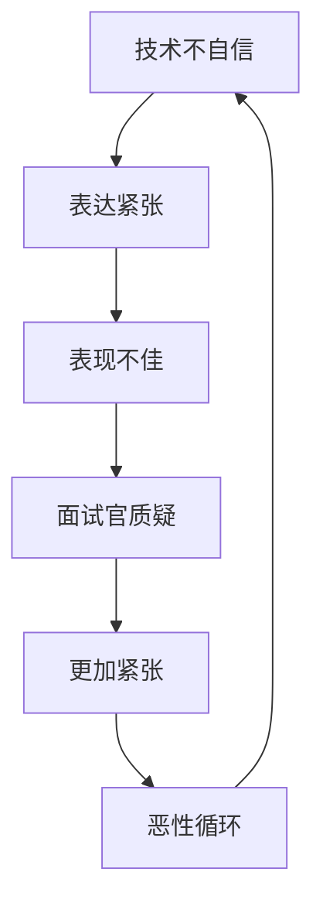

# 🎯 测试开发工程师表达训练与心理调节完全指南

> **作者：Interviewer-2 - 硅谷独角兽捕手**  
> **适用对象：面试紧张、表达能力需要提升的测试开发工程师**  
> **核心理念：系统性脱敏训练 + 三层心理防护 + 肌肉记忆建立**

---

## 🧠 **面试紧张心理机制解构**

### **紧张产生的根本公式**
```
面试紧张 = 不确定性 × 高风险感知 × 技能信心不足
```

### **四大紧张类型深度分析**

| 紧张类型 | 心理根源 | 生理表现 | 对表达的影响 | 应对重点 |
|---------|---------|---------|-------------|---------|
| **认知紧张** | 对技术深度缺乏信心 | 大脑空白、思维混乱 | 逻辑断层、答非所问 | 技术准备充分性 |
| **表达紧张** | 语言组织能力担忧 | 口干、语速过快 | 结构混乱、表达不清 | 表达技巧训练 |
| **社交紧张** | 面试官权威压迫感 | 手心出汗、身体僵硬 | 声音发抖、眼神回避 | 社交自信建立 |
| **结果紧张** | 对失败后果过度担忧 | 心跳加速、呼吸急促 | 患得患失、保守回答 | 心态调整训练 |

### **紧张的恶性循环机制**


**打破恶性循环的关键**：在任何一个环节建立正向反馈

---

## 🏋️ **28天系统化表达训练计划**

### **训练原理：递进式脱敏 + 肌肉记忆建立**

**核心理念**：
- **循序渐进**：从低压力到高压力环境逐步适应
- **重复强化**：通过大量重复建立表达肌肉记忆
- **实战导向**：所有训练都围绕真实面试场景设计

### **Week 1: 基础表达能力建设** 
> **目标**：建立表达肌肉记忆，消除基础紧张  
> **环境**：无压力环境，独立练习为主  
> **强度**：每天30分钟

#### **Day 1-2: 镜子练习法**
```
训练内容：
- 对镜子完成自我介绍 × 20次
- 观察自己的面部表情和肢体语言
- 记录每次练习的语速和停顿

评估标准：
✅ 能够流利完成90秒自我介绍
✅ 语速控制在180-200字/分钟
✅ 面部表情自然，眼神接触稳定
```

#### **Day 3-4: 录音回放分析**
```
训练内容：
- 录制自我介绍音频，回放分析
- 识别口头禅、重复词汇
- 练习语调变化和重点强调

分析维度：
📊 语速节奏：过快/过慢/不均匀
📊 语音清晰度：咬字模糊/方言口音
📊 逻辑连贯性：停顿位置/逻辑跳跃
📊 情感表达：单调/缺乏感染力
```

#### **Day 5-6: 技术概念复述训练**
```
训练内容：
- 选择5个核心技术概念
- 用3分钟深入解释每个概念
- 练习从抽象到具体的表达方式

技术概念清单：
🔧 自动化测试框架设计原理
🔧 CI/CD流水线搭建过程
🔧 性能测试瓶颈分析方法
🔧 分布式系统测试策略
🔧 测试平台架构设计思路
```

#### **Day 7: 朋友/家人模拟**
```
训练内容：
- 找朋友或家人进行模拟面试
- 完整的自我介绍 + 5个基础问题
- 获得第三方反馈和建议

基础问题清单：
1. 请介绍一下你最有成就感的项目
2. 你在团队中通常担任什么角色？
3. 你最擅长的技术栈是什么？
4. 遇到技术难题时你是如何解决的？
5. 你的职业规划是什么？
```

### **Week 2: 结构化表达训练**
> **目标**：建立逻辑框架，提升表达条理性  
> **环境**：中等压力环境，专业对话  
> **强度**：每天45分钟

#### **Day 8-10: STAR框架专项训练**
```
训练内容：
- 用STAR框架描述5个项目经验
- 每个项目准备3分钟版本和8分钟版本
- 重点练习量化成果的表达

STAR框架模板：
📍 Situation: 项目背景和面临的挑战
📍 Task: 你承担的具体任务和目标
📍 Action: 采用的技术方案和实施过程
📍 Result: 量化的成果和业务价值

练习项目类型：
- 自动化测试框架搭建
- 测试平台开发
- 性能优化改进
- 质量流程建设
- 技术难题攻关
```

#### **Day 11-13: 技术深度讲解训练**
```
训练内容：
- 选择核心技术栈，进行15分钟深度讲解
- 从原理→应用→优化→未来发展的递进结构
- 练习应对追问的技术储备

深度讲解结构：
🔍 技术原理：底层机制和工作流程
🔍 实际应用：在项目中的具体使用
🔍 优化经验：性能调优和问题解决
🔍 对比分析：与其他技术的优劣对比
🔍 发展趋势：技术演进和学习方向

技术栈选择建议：
- Python自动化测试生态
- Selenium WebDriver深度应用
- Jenkins CI/CD最佳实践
- Docker容器化测试环境
- JMeter性能测试调优
```

#### **Day 12-14: 即兴问答训练**
```
训练内容：
- 随机抽取技术问题，3分钟即兴回答
- 练习在不充分准备下的结构化表达
- 训练"不知道"时的专业应对方式

即兴回答结构：
💡 开头：重述问题，表达理解
💡 主体：基于已知经验的分析
💡 不足：诚实承认知识局限
💡 学习：表达学习意愿和方式
💡 转接：主动引导到熟悉领域

问题库建设：
- 收集50个常见技术面试问题
- 按难度分为基础/中等/困难三档
- 每天随机抽取10个进行练习
```

### **Week 3: 压力适应性训练**
> **目标**：在压力环境下保持表达稳定性  
> **环境**：高压力模拟，接近真实面试  
> **强度**：每天60分钟

#### **Day 15-17: 打断式回答训练**
```
训练内容：
- 回答过程中被故意打断
- 练习快速重组思路继续回答
- 训练在干扰下的专注力保持

打断场景设置：
🎯 技术细节追问：深入某个技术实现
🎯 逻辑质疑：对你的方案提出质疑
🎯 时间压力：要求快速回答复杂问题
🎯 多线程问题：同时考察多个技术点

应对策略训练：
- "您的问题很有价值，让我重新整理一下刚才的思路"
- "您提到的点确实需要考虑，基于我的经验..."
- "这个细节涉及具体实现，我简单说明一下流程..."
```

#### **Day 18-20: 连续追问应对训练**
```
训练内容：
- 单个问题的3-5层深度追问
- 练习在知识边界处的专业应对
- 训练压力下的逻辑清晰度

追问链条设计：
🔗 Layer 1: 你用过Selenium吗？
🔗 Layer 2: Selenium的工作原理是什么？
🔗 Layer 3: 如何解决元素定位不稳定？
🔗 Layer 4: 你们项目中遇到过哪些具体问题？
🔗 Layer 5: 这些问题的根本原因是什么？

深度应对策略：
- 准备每个技术点的3层深度解释
- 储备具体的项目实例和数据
- 练习从理论到实践的过渡表达
- 掌握技术边界的诚实表达
```

#### **Day 21: 时间压力练习**
```
训练内容：
- 限时回答复杂技术问题
- 3分钟内完成项目介绍
- 1分钟内解释技术概念

时间管理策略：
⏰ 开头10秒：理解问题，确定回答框架
⏰ 中间70%时间：核心内容的结构化表达
⏰ 结尾20%时间：总结要点，询问补充

压力下的表达技巧：
- 放慢语速，提高表达质量
- 使用手势辅助逻辑表达
- 关键信息重复强调
- 保持眼神交流增强说服力
```

### **Week 4: 实战化综合演练**
> **目标**：真实面试环境下的综合能力测试  
> **环境**：完全仿真，高压力高强度  
> **强度**：每天90分钟

#### **Day 22-24: 完整面试流程模拟**
```
训练内容：
- 1小时完整面试模拟
- 包含自我介绍、技术问答、项目深挖、反问环节
- 全程录音录像，事后复盘分析

面试流程设计：
🎬 开场5分钟：自我介绍 + 破冰交流
🎬 技术25分钟：核心技术栈深度考察
🎬 项目20分钟：项目经验详细挖掘
🎬 综合8分钟：团队协作、职业规划
🎬 反问2分钟：向面试官提问

复盘分析维度：
📋 内容完整性：是否覆盖所有要点
📋 逻辑清晰度：表达是否条理分明
📋 技术准确性：技术描述是否准确
📋 互动效果：与面试官的互动质量
```

#### **Day 25-26: 多轮面试连续作战**
```
训练内容：
- 连续3轮不同风格的面试官
- 测试体力和心理承受能力
- 练习在疲劳状态下的稳定发挥

面试官风格设计：
👨‍💼 技术专家型：深度技术问题，连续追问
👩‍💼 业务导向型：关注项目价值和业务理解
🧑‍💼 压力测试型：故意制造压力和对抗

能量管理策略：
- 合理分配精力到不同面试环节
- 识别面试官类型快速调整策略
- 在连续面试中保持专业状态
```

#### **Day 27-28: 压力面试专项训练**
```
训练内容：
- 独角兽捕手风格的高压面试
- 连续质疑和技术挑战
- 极限压力下的专业应对

压力面试场景：
🔥 技术能力质疑："你确定你精通这个技术吗？"
🔥 项目贡献质疑："这个项目你到底做了什么？"
🔥 数据真实性质疑："这个数据看起来不太可能"
🔥 职业能力质疑："你觉得自己适合这个岗位吗？"

抗压应对话术：
- "我理解您的质疑，让我具体说明..."
- "这个数据确实比较突出，具体情况是..."
- "我在这个项目中的具体贡献是..."
- "基于我的经验和能力，我认为..."
```

---

## 🛡️ **三层心理防护体系**

### **第一层：认知重构 - 思维模式转换**

#### **错误认知 → 正确认知对照表**
| 错误认知 | 危害 | 正确认知 | 收益 |
|---------|------|---------|------|
| "面试官都很严厉，会故意刁难我" | 产生对抗心理，影响交流 | "面试官希望找到合适人选，我们目标一致" | 建立合作心态，提升沟通效果 |
| "我一定要完美回答每个问题" | 压力过大，容易紧张 | "诚实专业比完美答案更重要" | 降低心理负担，展现真实能力 |
| "答不出来就完了" | 因恐惧而逃避或放弃 | "不知道就学习，展现成长潜力" | 保持积极心态，体现学习能力 |
| "这次面试决定我的未来" | 过度焦虑，影响发挥 | "面试是双向选择，机会很多" | 平常心对待，发挥正常水平 |

#### **认知重构练习**
```
每日认知训练（5分钟）：
1. 识别负面自动思维
2. 分析思维的非理性成分
3. 用证据检验思维的真实性
4. 重构为更现实和积极的认知
5. 重复新认知直到内化

示例：
负面思维："我技术不如别人，肯定会被淘汰"
证据检验："我有5年经验，成功完成过多个项目"
重构认知："我有自己的技术优势，完全有竞争力"
```

### **第二层：生理调节 - 身体状态管理**

#### **面试前30分钟生理准备程序**
```
时间分配：
30分钟前：深呼吸训练 + 积极暗示
20分钟前：渐进性肌肉放松
10分钟前：整理仪表 + 心理预演
进入面试：微笑准备 + 自信姿态
```

#### **4-7-8呼吸法详细步骤**
```
步骤说明：
1. 用鼻子吸气4秒钟
2. 屏住呼吸7秒钟
3. 用嘴呼气8秒钟
4. 重复4-6个循环

科学原理：
- 激活副交感神经系统
- 降低心率和血压
- 缓解焦虑和紧张情绪
- 提高注意力集中度

最佳使用时机：
- 面试前30分钟
- 等待面试时
- 面试中感到紧张时
- 任何需要快速冷静的时刻
```

#### **渐进性肌肉放松法**
```
肌肉群放松顺序：
1. 面部肌肉：紧张5秒 → 放松10秒
2. 颈部肩部：紧张5秒 → 放松10秒
3. 上肢肌肉：紧张5秒 → 放松10秒
4. 胸部腹部：紧张5秒 → 放松10秒
5. 下肢肌肉：紧张5秒 → 放松10秒

操作要点：
- 紧张时用力70%，避免拉伤
- 放松时完全放松，体会对比感
- 全程配合深呼吸
- 总时间控制在15分钟内
```

#### **积极心理暗示语句库**
```
技术信心类：
"我已充分准备，技术储备深厚"
"我有丰富的项目经验，完全能胜任"
"我的技术能力在同行中有竞争优势"

表达能力类：
"我能够清晰表达自己的想法"
"我的逻辑思维清晰，表达有条理"
"我善于沟通，能够很好地展示自己"

心态调节类：
"这次面试是展示自己的好机会"
"面试官是专业的，会公正评价我"
"无论结果如何，这都是宝贵的经验"

应变能力类：
"遇到不会的问题，我会坦诚应对"
"我有很强的学习能力，可以快速成长"
"我能够在压力下保持冷静和专业"
```

### **第三层：行为策略 - 应对技巧实施**

#### **面试中的即时压力应对话术**
```
需要思考时：
- "这个问题很有价值，让我整理一下思路"
- "您提到的角度很有意思，我想从...方面来分析"
- "这涉及到几个层面，让我分别说明一下"

不会回答时：
- "这个技术在我之前的项目中接触不多，但基于我对...的理解"
- "我对这块的实践经验相对有限，不过理论上应该是..."
- "这确实是我需要深入学习的领域，如果有机会我会..."

答错被追问时：
- "您的提醒让我意识到理解有偏差，实际应该是..."
- "感谢您的指正，让我重新梳理一下这个问题"
- "看来我对这个概念的理解还不够准确，正确的应该是..."

被质疑时：
- "我理解您的质疑，让我提供更具体的细节来说明"
- "这个结果确实比较突出，具体的实现过程是..."
- "我在项目中的具体角色和贡献是..."
```

#### **能量管理策略**
```
问题分级管理：
🔥 高能量问题（全力投入）：
- 核心技术栈深度问题
- 最重要的项目经验
- 关键的技术决策逻辑

🔵 中能量问题（稳定发挥）：
- 基础技术概念
- 团队协作经验
- 工作方式方法

🟢 低能量问题（保留实力）：
- 个人兴趣爱好
- 薪资期望
- 其他公司面试情况

能量分配原则：
- 重要问题占用80%精力
- 一般问题占用15%精力
- 次要问题占用5%精力
- 预留10%精力应对意外情况
```

#### **非语言沟通技巧**
```
眼神交流：
- 70%时间保持眼神接触
- 避免长时间凝视造成压力
- 思考时可以短暂移开视线
- 重点表达时直视对方眼睛

肢体语言：
- 保持端正但放松的坐姿
- 适当的手势辅助表达
- 避免频繁的小动作
- 身体微微前倾表示专注

语音语调：
- 语速控制在180-200字/分钟
- 重点内容适当放慢语速
- 保持语调的变化和起伏
- 声音清晰有力，充满信心

面部表情：
- 保持适度的微笑
- 表情自然，与内容匹配
- 听问题时表现出专注和兴趣
- 回答时表情认真但不紧张
```

---

## 📊 **训练效果评估体系**

### **自我评估量表**

#### **表达能力评估（满分100分）**
```
内容组织能力（25分）：
□ 逻辑结构清晰，层次分明 (5分)
□ 要点突出，详略得当 (5分)
□ 时间控制合理，不超时不过短 (5分)
□ 技术描述准确，深度适中 (5分)
□ 项目经历真实可信，量化充分 (5分)

语言表达能力（25分）：
□ 语速适中，节奏感好 (5分)
□ 发音清晰，咬字清楚 (5分)
□ 语调自然，富有变化 (5分)
□ 用词准确，表达流畅 (5分)
□ 无明显口头禅和重复词 (5分)

互动沟通能力（25分）：
□ 眼神交流自然，不回避 (5分)
□ 身体语言得体，姿态自信 (5分)
□ 能够理解问题意图，回答针对性强 (5分)
□ 面对追问能冷静应对 (5分)
□ 适时提问，展现思维活跃 (5分)

心理状态管理（25分）：
□ 紧张程度可控，不影响表达 (5分)
□ 遇到不会的问题能坦诚应对 (5分)
□ 压力下能保持逻辑清晰 (5分)
□ 自信程度适度，不卑不亢 (5分)
□ 整体状态稳定，表现一致 (5分)
```

#### **训练进度跟踪表**
```
Week 1进度：基础表达能力
□ Day 1-2: 镜子练习 __ 完成度 __%
□ Day 3-4: 录音分析 __ 完成度 __%  
□ Day 5-6: 概念复述 __ 完成度 __%
□ Day 7: 朋友模拟 __ 完成度 __%

Week 2进度：结构化表达
□ Day 8-10: STAR训练 __ 完成度 __%
□ Day 11-13: 深度讲解 __ 完成度 __%
□ Day 12-14: 即兴问答 __ 完成度 __%

Week 3进度：压力适应
□ Day 15-17: 打断训练 __ 完成度 __%
□ Day 18-20: 追问应对 __ 完成度 __%
□ Day 21: 时间压力 __ 完成度 __%

Week 4进度：实战演练
□ Day 22-24: 完整模拟 __ 完成度 __%
□ Day 25-26: 多轮面试 __ 完成度 __%
□ Day 27-28: 压力专项 __ 完成度 __%
```

### **外部反馈收集**

#### **模拟面试反馈表**
```
面试官评价维度：
技术能力展示 (1-10分): ___ 
- 技术描述准确性
- 技术深度体现
- 实战经验可信度

表达沟通能力 (1-10分): ___
- 逻辑清晰度
- 语言流畅度  
- 互动效果

心理素质表现 (1-10分): ___
- 抗压能力
- 应变能力
- 专业态度

总体印象评分 (1-10分): ___
- 是否愿意进入下轮面试
- 技术岗位匹配度
- 团队融入可能性

改进建议：
最需要提升的方面: _______________
具体改进建议: _______________
推荐的训练重点: _______________
```

---

## 🎯 **不同紧张程度的定制化方案**

### **轻度紧张者（能基本完成表达，偶有卡顿）**
```
症状特征：
- 偶尔出现语速过快或停顿
- 在追问时会有短暂的思维空白
- 整体逻辑清晰但细节表达不够流畅

重点训练项目：
1. Week 1-2: 专注基础表达和结构化训练
2. 减少Week 3-4的高压训练强度
3. 更多时间投入技术深度准备

训练时间分配：
- 基础训练: 40%
- 结构化训练: 40%  
- 压力适应: 20%
```

### **中度紧张者（表达基本完整，压力下表现下降明显）**
```
症状特征：
- 面试开始阶段比较紧张
- 遇到不熟悉问题时明显慌乱
- 在连续追问下容易失去条理

重点训练项目：
1. 完整执行4周训练计划
2. 额外增加心理调节训练
3. 重点强化Week 3的压力适应训练

训练时间分配：
- 基础训练: 25%
- 结构化训练: 25%
- 压力适应: 35%
- 心理调节: 15%
```

### **重度紧张者（严重影响表达，可能出现大脑空白）**
```
症状特征：
- 面试前就开始严重焦虑
- 容易出现大脑空白，无法组织语言
- 声音发抖，身体明显紧张

重点训练项目：
1. 延长基础训练周期至2周
2. 增加心理调节和生理训练
3. 循序渐进，避免过度压力训练
4. 考虑寻求专业心理咨询

训练时间分配：
- 基础训练: 40%
- 心理调节: 30%
- 结构化训练: 20%
- 压力适应: 10%

额外支持措施：
- 专业心理咨询
- 药物辅助治疗（咨询医生）
- 增加冥想和放松训练
- 延长整体训练周期至6-8周
```

---

## 🚀 **训练成果固化与持续提升**

### **肌肉记忆巩固策略**
```
训练后维护计划：
- 每周进行2次完整自我介绍练习
- 每月进行1次完整模拟面试
- 定期更新技术知识和项目经验
- 关注行业动态，保持学习状态

长期技能保持：
- 参加技术分享和演讲，提升表达机会
- 主动承担项目汇报和培训任务
- 与同行进行技术交流和讨论
- 关注面试技巧和沟通技能的最新发展
```

### **持续改进机制**
```
定期评估项目：
- 每次真实面试后的复盘分析
- 录音录像的定期回顾
- 第三方反馈的收集整理
- 个人能力发展的跟踪记录

技能升级计划：
- 根据行业发展更新技术储备
- 学习新的面试技巧和沟通方法
- 提升项目管理和团队协作能力
- 建立个人技术品牌和专业影响力
```

---

## 📚 **配套资源与工具推荐**

### **训练工具推荐**
```
录音设备：
- 手机录音App: Voice Memos (iOS) / 录音机 (Android)
- 专业录音设备: Zoom H1n便携录音笔
- 在线录音工具: Online Voice Recorder

视频录制：
- 手机视频功能 + 三脚架
- 电脑摄像头 + OBS录屏软件
- 在线视频会议工具: Zoom / 腾讯会议

模拟面试平台：
- Pramp: 在线技术面试练习
- InterviewBit: 编程面试准备
- LeetCode: 算法面试练习
- 牛客网: 综合面试练习
```

### **学习资源推荐**
```
书籍推荐：
📚 《演讲的力量》- 克里斯·安德森
📚 《沟通的艺术》- 罗纳德·阿德勒  
📚 《非暴力沟通》- 马歇尔·卢森堡
📚 《心理急救》- 盖伊·温奇

在线课程：
🎓 TED演讲技巧课程
🎓 Coursera沟通技能课程
🎓 网易云课堂面试技巧课程
🎓 慕课网技术面试课程

心理调节资源：
🧘‍♂️ Headspace冥想App
🧘‍♂️ Calm放松训练App
🧘‍♂️ 正念减压课程
🧘‍♂️ 认知行为疗法自助指南
```

---

## ⚠️ **常见训练误区与避免方法**

### **训练误区识别**
```
误区1: 只练习熟悉的内容
危害: 面对未知问题时依然会紧张
正确做法: 故意练习不熟悉和困难的问题

误区2: 过度依赖背诵
危害: 答案僵化，缺乏灵活性
正确做法: 理解逻辑框架，灵活组织内容

误区3: 忽略非语言沟通
危害: 内容很好但整体印象不佳
正确做法: 同时训练语言和肢体表达

误区4: 训练强度过大导致倦怠
危害: 产生逆反心理，影响训练效果
正确做法: 合理安排训练强度，适当休息

误区5: 缺乏针对性，训练泛化
危害: 效果不明显，浪费时间精力
正确做法: 根据个人特点定制化训练
```

### **训练效果不佳的应对**
```
问题诊断：
1. 分析训练方法是否合适
2. 检查训练强度是否适当
3. 评估个人执行是否到位
4. 考虑是否需要外部帮助

调整策略：
- 降低训练强度，延长训练周期
- 寻找更适合的训练方法
- 增加专业指导和外部反馈
- 考虑个人特质调整训练重点
```

---

## 🎉 **结语与激励**

**表达能力和心理调节能力是可以通过系统训练显著提升的技能。**

### **成功案例激励**
```
真实案例分享：
"我原来面试时紧张得话都说不出来，
通过28天系统训练，现在能够自信地与面试官交流，
成功拿到了3个心仪公司的offer。
关键是要相信自己，坚持训练。"

"技术能力强但表达不好，是很多程序员的通病。
这套训练方法帮我找到了表达的逻辑和节奏，
现在不仅面试顺利，工作中的沟通也更有效了。"
```

### **核心成功要素**
```
🎯 系统性：完整的训练体系，不遗漏任何重要环节
🎯 渐进性：从易到难，循序渐进建立能力
🎯 针对性：根据个人特点定制训练重点
🎯 坚持性：21天养成习惯，28天建立能力
🎯 实战性：所有训练都围绕真实面试场景
```

### **最后的建议**
```
记住这四个关键词：
💪 准备充分：技术储备 + 表达训练 + 心理调节
🎯 定位准确：了解自己的优势和不足
🤝 真诚专业：诚实面对问题，专业解决问题  
🚀 持续成长：把每次面试当作学习机会
```

**相信通过系统化的训练，你一定能够在面试中展现最好的自己，获得理想的工作机会！**

---

> **本指南由Interviewer-2基于多年面试经验和心理学理论编写**  
> **适用于所有希望提升面试表达能力的测试开发工程师**  
> **训练需要坚持，效果需要时间，请耐心实践**